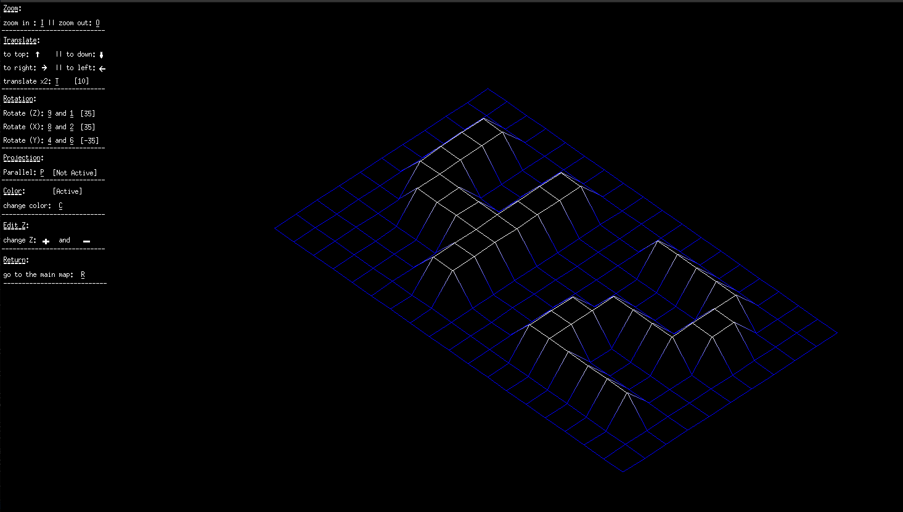

# FDF - 42 Network Wireframe Renderer

FDF is a simple 3D wireframe renderer built as part of the 42 curriculum. It reads `.fdf` files containing 3D heightmap data, projects them into 2D space, and renders them using MiniLibX.

## 🖼️ Preview
<!-- Add an image or GIF of your FDF program running -->


## 🖼️  Preview
<!-- Add an image or GIF of your FDF program running -->


## 🖼️   Preview
<!-- Add an image or GIF of your FDF program running -->


## 📖 Features
- Parses `.fdf` map files to extract 3D points.
- Implements **isometric projection** for 3D visualization.
- Uses **Bresenham’s line algorithm** to draw connections between points.
- Keyboard controls for zoom, movement, and rotation.

## 🛠️ Installation

1. **Clone the repository:**
   ```sh
   git clone https://github.com/alaktari/FDF.git
   cd FDF

